## 环境

- node: >= 20

## 开发

本地开发需要配合主题模版服务一起跑。目前只有一套主题：[Arise Theme Github 仓库](https://github.com/lizuncong/arise-theme)

本地clone 下来web editor和arise theme的代码，执行下面操作将两个服务跑起来

- git clone下来
- npm install
- npm run dev

然后修改src/constant.ts文件，将里面的origin信息改成你自己的即可。

## 效果

<video  autoplay src="./docs/images/preview.mp4" height="160" />

## 架构设计

### 技术栈：React

编辑器和主题开发都使用React。实际上主题可以使用任何的模版渲染引擎，只要遵守主题的Schema协议以及编辑器的通信协议即可

### 编辑器

编辑器只提供基础的控件，比如下拉选择控件、输入框控件等，这些控件统一收敛在src/pages/Editor/Widgets下面。

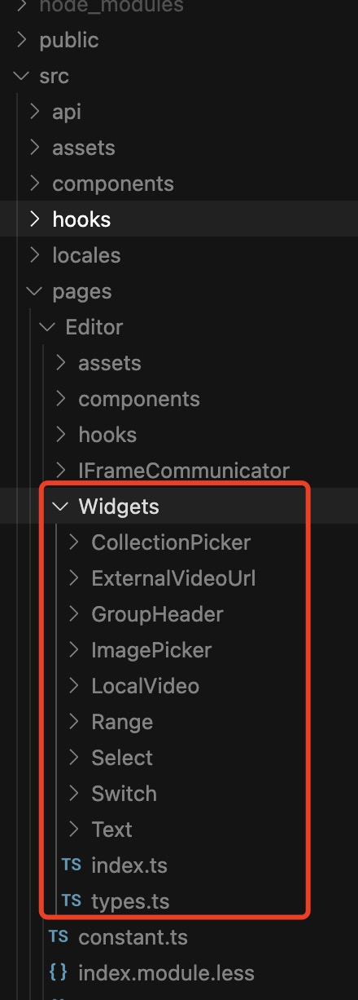

然后在主题的section/schema中，通过type定义控件的类型

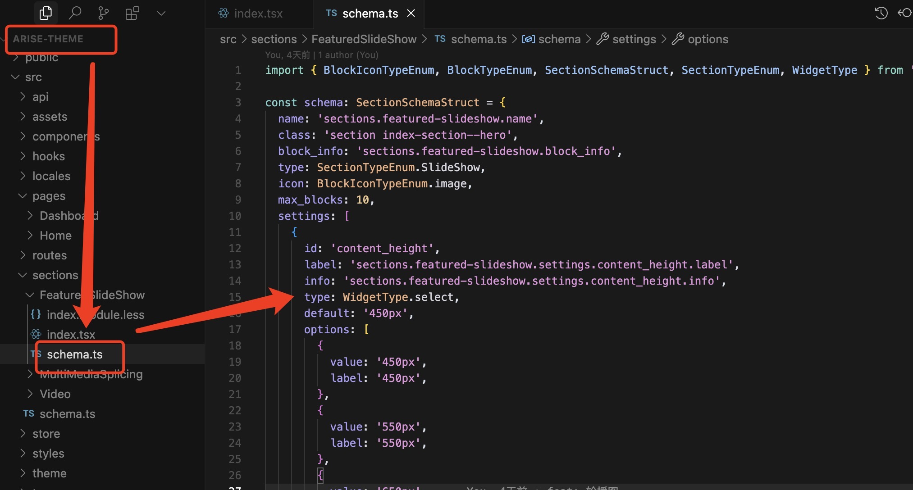

### 主题 schema

编辑器只提供基础控件，主题有哪些风格，哪些组件，组件有哪些配置项都是由主题自己决定。通过这种设计，能够让编辑器和主题很好的解耦。同时，也能让第三方开发者参与开发主题或者组件，只要遵守协议规定即可。

在主题代码中，比如[arise-theme](https://github.com/lizuncong/arise-theme)，src/sections定义的是编辑器可以添加的组件

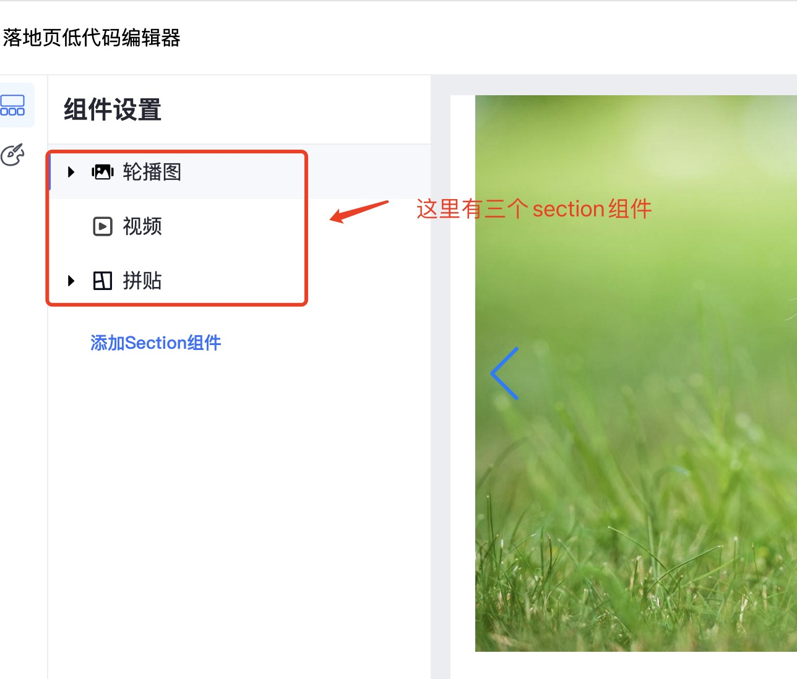

#### section schema

section schema如下：

```js
const schema: SectionSchemaStruct = {
  name: 'sections.featured-slideshow.name',
  class: 'section index-section--hero',
  block_info: 'sections.featured-slideshow.block_info',
  type: SectionTypeEnum.SlideShow,
  icon: BlockIconTypeEnum.image,
  max_blocks: 10,
  settings: [
    {
      id: 'content_height',
      label: 'sections.featured-slideshow.settings.content_height.label',
      type: WidgetType.select,
      // ...
    },

    {
      type: WidgetType.switch,
      id: 'show_progress',
      label: 'sections.featured-slideshow.settings.show_progress.label',
    },
  ],
  blocks: [
    {
      type: BlockTypeEnum.image,
      icon: BlockIconTypeEnum.image,
      name: 'sections.featured-slideshow.blocks.image.name',
      settings: [],
    },
  ],
  presets: [
    {
      category_index: 1,
      category: 'sections.featured-slideshow.presets.presets__0.category',
      name: 'sections.featured-slideshow.presets.presets__0.name',
      settings: {
        content_height: 100,
        show_progress: true,
      },
      blocks: [
        {
          type: BlockTypeEnum.image,
          settings: {
            image_text_layout: '100%',
          },
        },
        {
          type: BlockTypeEnum.image,
          settings: {
            image_text_layout: '100%',
          },
        },
      ],
    },
    {
      category_index: 1,
      category: 'sections.featured-slideshow.presets.presets__0.category',
      name: 'sections.featured-slideshow.presets.presets__1.name',
      settings: {
        content_height: 200,
        show_progress: false,
        show_arrows: false,
        switch: false,
        autoplay: false,
        autoplay_speed: 17,
      },
      blocks: [
        {
          type: BlockTypeEnum.image,
          settings: {},
        },
        {
          type: BlockTypeEnum.image,
          settings: {
            image_text_layout: '100%',
          },
        },
        {
          type: BlockTypeEnum.image,
          settings: {
            image_text_layout: '100%',
          },
        },
      ],
    },
  ],
};
```

section schema中的settings描述的是组件的配置，表示组件都支持哪些配置，如下图：

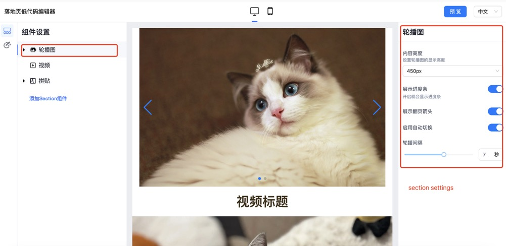

blocks定义的是组件可以添加哪些block，以拼贴组件为例，这个组件可以添加4种类型的block。

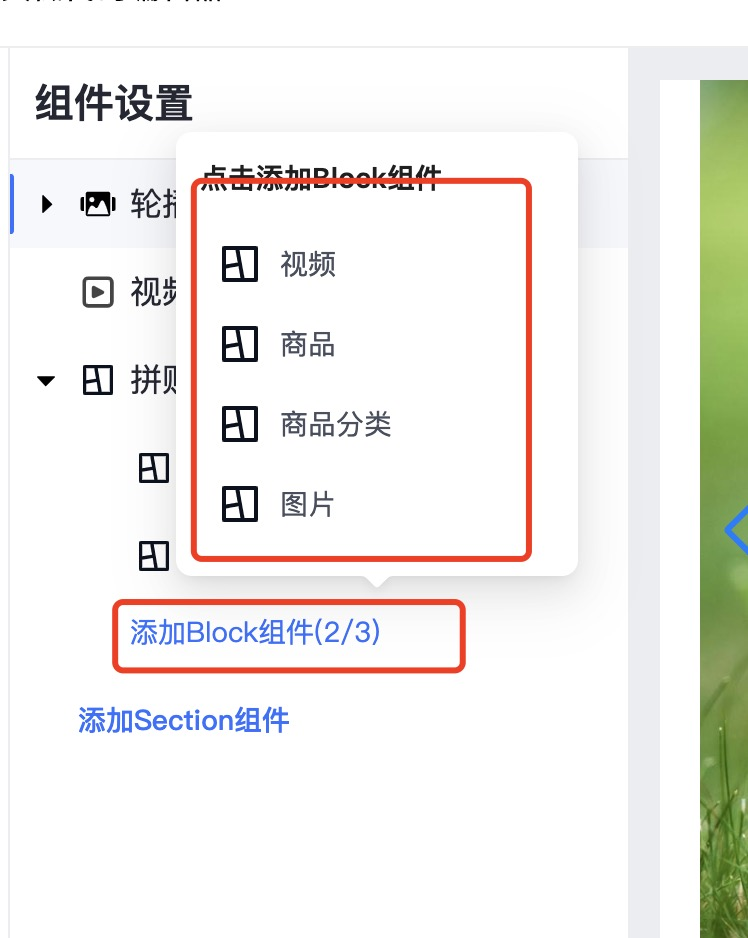

presets定义的是组件有几种预设的值，以轮播图为例，在添加组件时，轮播图有2个可以选择：轮播图1 和 轮播图2，这就是通过section schema中的presets数组定义的，presets数组有多少个预设值，那添加section组件时就有多少个
组件可以选择

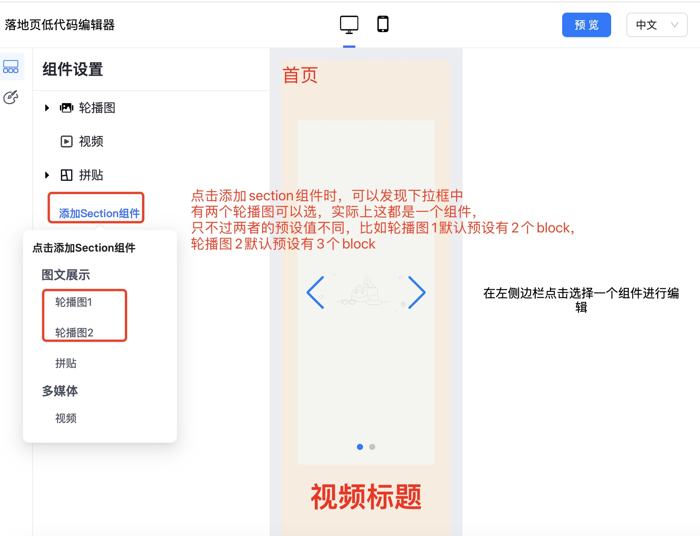

blocks数组中定义的是每个block类型的配置项

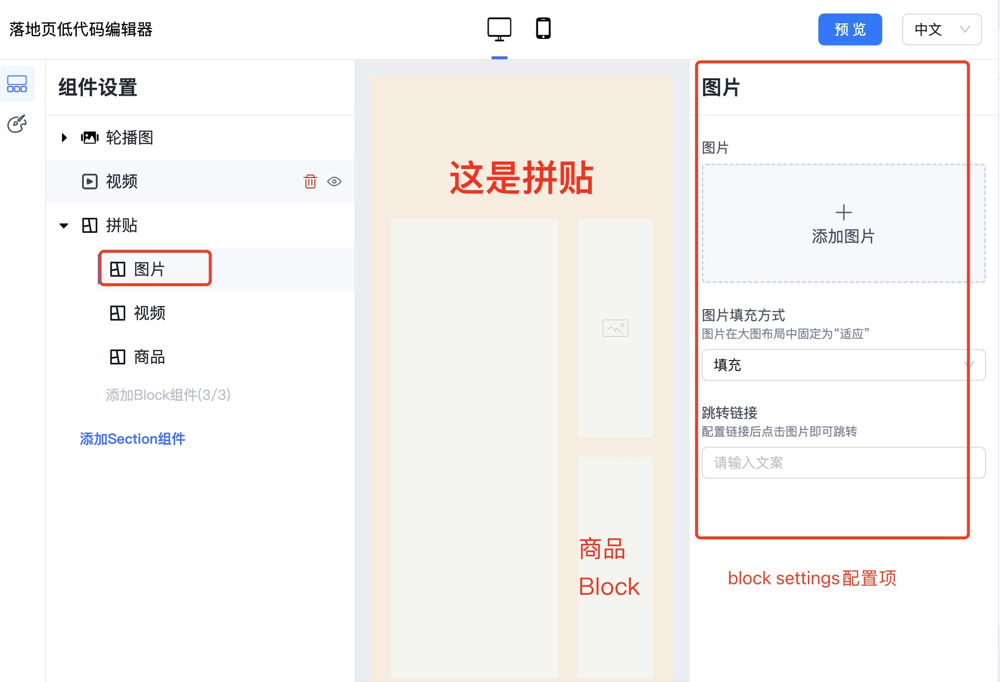

#### theme schema

theme schema定义的是全局配置项，比如页面背景颜色，字体，字体颜色等等，对应的配置项schema定义在src/theme/schema，如下所示：

```js
const schema: ThemeSchemaStruct = {
  info: {
    name: 'Arise-Pro',
    theme_name: 'Arise-Pro',
    theme_version: '0.0.1',
    theme_author: 'LZC',
    theme_documentation_url: '',
    theme_support_url: '',
    theme_cover_img: '',
    theme_home_pc_preview_img: '',
    theme_home_mobile_preview_img: '',
    theme_pdp_pc_preview_img: '',
    theme_pdp_mobile_preview_img: '',
    theme_type_version: '',
  },
  blocks: [],
  presets: [
    {
      type: AriseThemeStyle.Default,
      name: 'settings_schema.theme.default',
      settings: {
        color_page_background: '#ffffff',
        color_text: '#3d2f16',
      },
    },
    {
      type: AriseThemeStyle.Food,
      name: 'settings_schema.theme.food',
      settings: {
        color_page_background: '#f8edde',
      },
    },
    {
      type: AriseThemeStyle.Grounded,
      name: 'settings_schema.theme.grounded',
      settings: {
        color_page_background: '#000000',
        color_text: '#ffffff',
      },
    },
    {
      type: AriseThemeStyle.Hammer,
      name: 'settings_schema.theme.hammer',
      settings: {
        color_page_background: '#ffffff',
      },
    },
  ],
};

```

其中，blocks定义的是主题的全局配置项

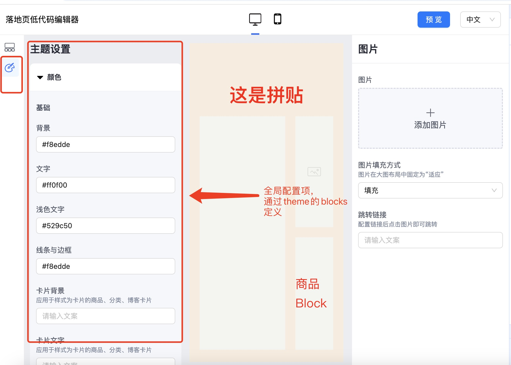

presets定义的是主题有几种风格，其实就是一些预设值：

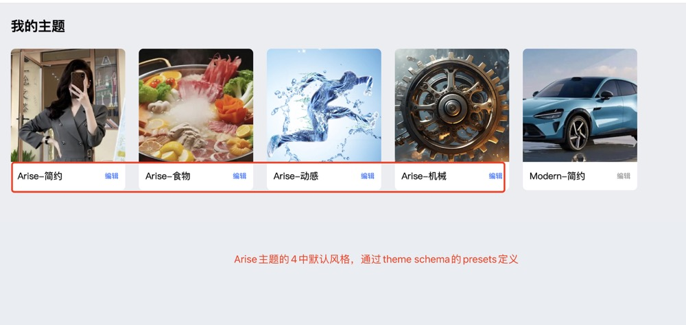

### 编辑器和主题通信

编辑器的主题预览区是通过iframe嵌入主题的url达到预览的，这两种的通信通过postmessage实现：

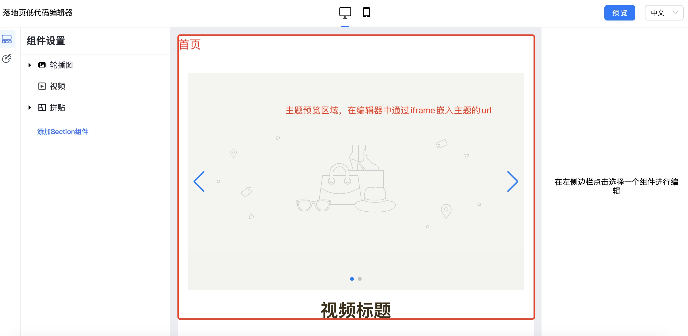

在编辑器代码中，iframe的通信封装在src/pages/Editor/IFrameCommunicator下面。

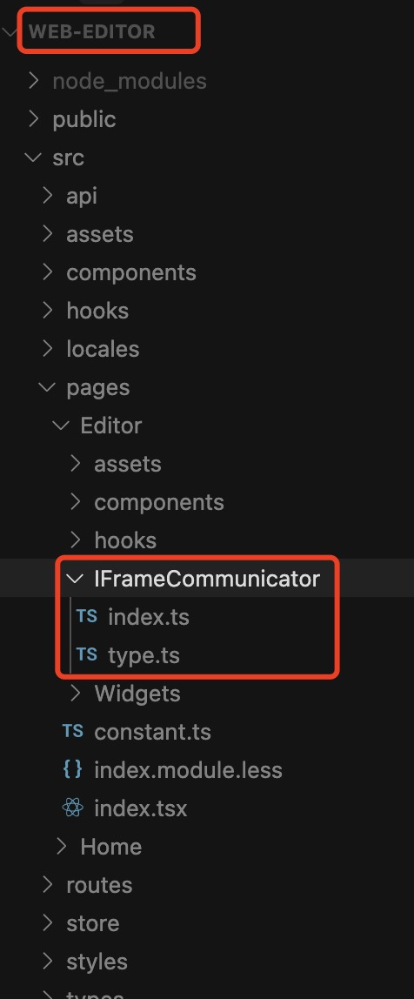

在编辑器中修改配置项的值，主题需要跟着变化，这些逻辑统一收敛在src/pages/Editor/hooks/useUpdateConfigDataAndNotify.ts这个钩子里面

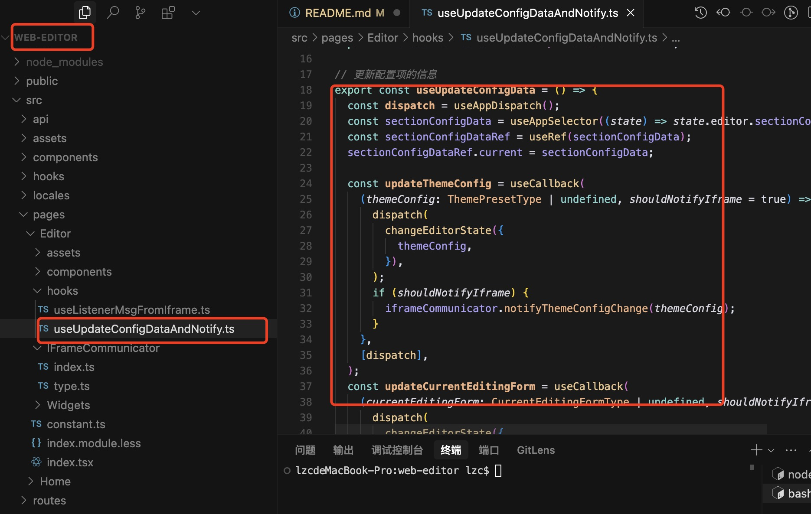

同时，编辑器接收主题的通知统一收敛在useListenerMsgFromIframe.ts里面。

在主题代码中，以[arise-theme](https://github.com/lizuncong/arise-theme)代码为例，主题监听编辑器的变更统一收敛在useListenerMsgFromEdtitor.ts中。

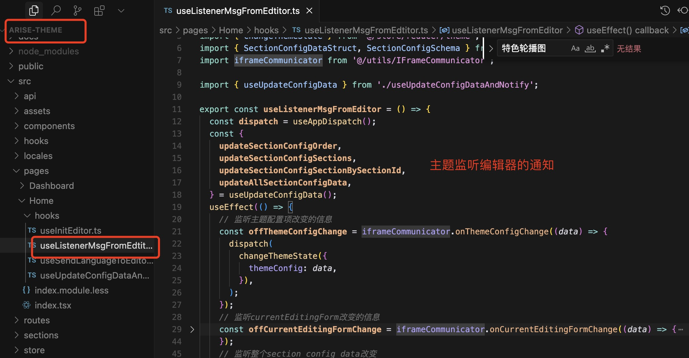
